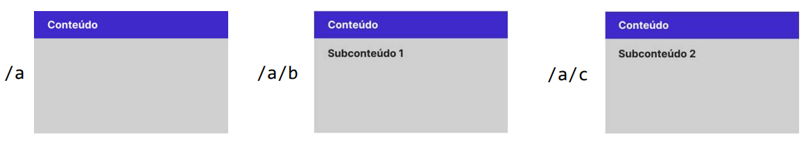

# Tutorial React Router DOM v6.4.1

O React Router DOM é uma biblioteca que permite a navegação entre diferentes componentes, simulando a sensação de navegar por várias páginas, mas sem a necessidade de recarregar a página.

## Criando o Projeto

```js
yarn create vite react-router-tutorial --template react-ts
```

## Instalando o React Router DOM

```js
npm add react-router-dom@6.4.1 @types/react-router-dom@5.3.3
```
ou
```js
yarn add react-router-dom@6.4.1 @types/react-router-dom@5.3.3
```

## Rotas

No componente `main.tsx`, definimos as rotas e sub-rotas.

Uma rota é definida pelo componente `<Route>`. Cada rota tem um `path` que determina a URL da página e um `element` que determina qual componente deve ser renderizado quando a rota é acessada.

```js
<BrowserRouter>
    <Routes>
        <Route path="/" element={<App />} />
        <Route path="expenses" element={<Expenses />} />
        <Route path="invoices" element={<Invoices />} />
    </Routes>
</BrowserRouter>
```

## Sub-Rotas

Sub-rotas são rotas que são aninhadas dentro de outras rotas. Elas permitem que você defina uma estrutura hierárquica para sua aplicação. No React Router DOM v6, as sub-rotas são definidas aninhando-se componentes `<Route>` dentro de outros componentes `<Route>`.

- A rota principal `/` renderiza o componente `App`.
- Dentro desta rota, temos duas sub-rotas: `/expenses` e `/invoices` que renderizam os componentes `Expenses` e `Invoices`, respectivamente.

Quando o usuário acessa a rota `/`, o componente `App` é renderizado. Se o usuário clicar no link "Expenses", a URL muda para `/expenses` e o componente `Expenses` é renderizado no lugar do `<Outlet />` no componente `App`.

```js
<BrowserRouter>
    <Routes>
        <Route path="/" element={<App />} >
            <Route path="expenses" element={<Expenses />} />
            <Route path="invoices" element={<Invoices />} />
        </Route>      
    </Routes>
</BrowserRouter>
```

Neste tutorial de exemplo, o componente `App` serve como um layout principal para a aplicação. Dentro deste componente tem links de navegação e um componente `<Outlet />`.

O componente `<Outlet />` é onde os componentes das sub-rotas serão renderizados. Pense nele como um espaço reservado para as sub-rotas.

```js
export default function App() {
  return (
    <>
      <nav className="router-links">
        <Link to="/invoices">Invoices</Link> | {" "}
        <Link to="/expenses">Expenses</Link>
      </nav>
      <Outlet />
    </>
  );
}
```

### Diferença entre Rotas e Sub-rotas:

- **Rotas**: São os principais pontos de entrada da aplicação. No seu exemplo, a rota principal é `/` que renderiza o componente `App`.
  
- **Sub-rotas**: São rotas que estão aninhadas dentro de outras rotas. Elas são úteis quando você quer renderizar diferentes componentes dentro de um layout principal. No exemplo, `Expenses` e `Invoices` são sub-rotas da rota principal `/`.

### Quando usar uma ou outra:

- Use **rotas** para definir os principais pontos de entrada da sua aplicação ou quando você tem páginas que não compartilham um layout comum.

- Use **sub-rotas** quando você quer renderizar diferentes componentes dentro de um layout comum. Por exemplo, se você tem um painel de administração com um menu lateral e quer renderizar diferentes componentes dependendo do link clicado no menu, você usaria sub-rotas.

# Regra geral para sub-rotas aninhadas

Se uma rota leva a um conteúdo, e dentro deste conteúdo há outro(s) subconteúdo(s) que correspondem a novas rotas, então deve-se definir os subconteúdo(s) como sub-rotas aninhadas. No conteúdo principal deverá haver um elemento `<Outlet />` para definir onde aparecerá o subconteúdo.

```js
<Route path="/a/" element="{<Conteudo />}">
    <Route path="b" element="{<Subconteudo1 />}" />
    <Route path="c" element="{<Subconteudo2 />}" />
</Route>
```

## Exemplo

<div align="center">
  
</div>


## Fonte oficial

- [React Router DOM](https://reactrouter.com/en/v6.3.0/getting-started/tutorial)
- [Components and Props](https://legacy.reactjs.org/docs/components-and-props.html)
- [React Props](https://www.w3schools.com/react/react_props.asp)
- [React Router DOM v6.4.1](https://www.npmjs.com/package/react-router-dom/v/6.4.1)